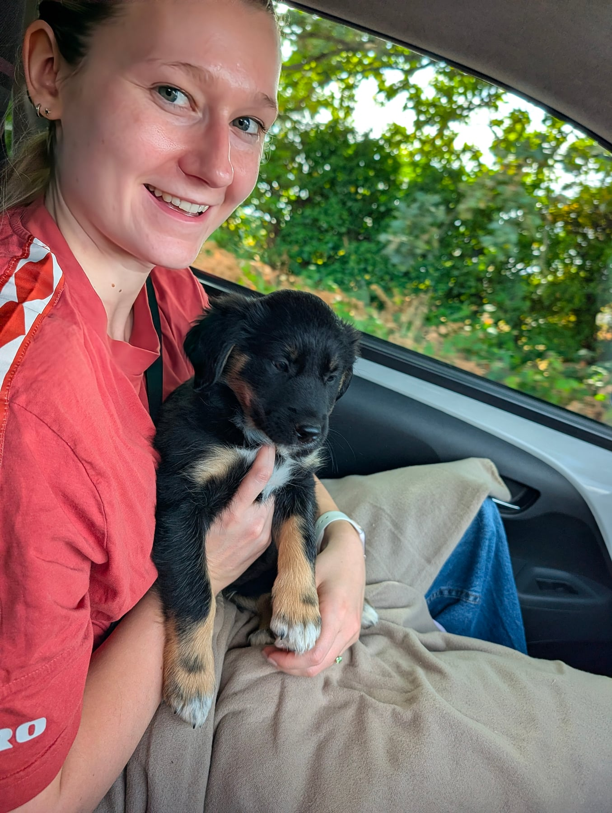
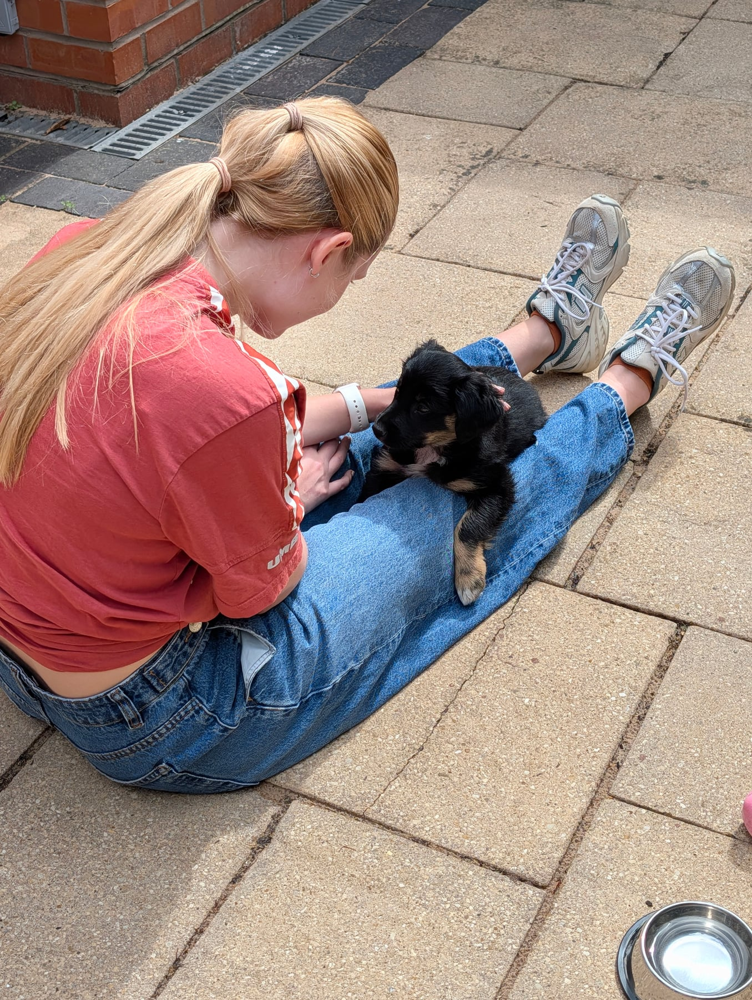
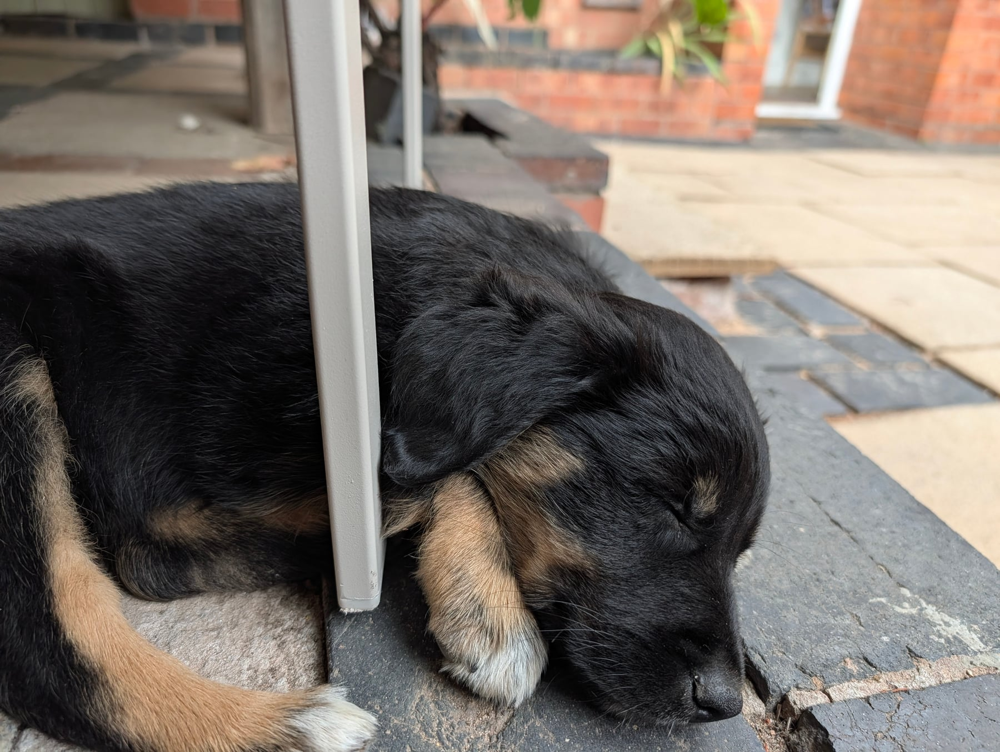

We picked her up today: eight weeks old, and about an hour and a half in the car to get her home. She had her first vaccination before we even left.

The plan for day one was deliberately boring: keep things safe, small and predictable. No training pressure, just food, water, a bit of gentle exploring, and lots of sleep. Her crate went straight into our bedroom, right beside the bed, so the first night wouldn't feel like too big a leap from wherever she'd been sleeping before.

Toileting outdoors went well from the very first trip out. We genuinely didn't expect that to click so fast. Everything else was just... settling. Watching a very small, very new dog work out that this was home now.

