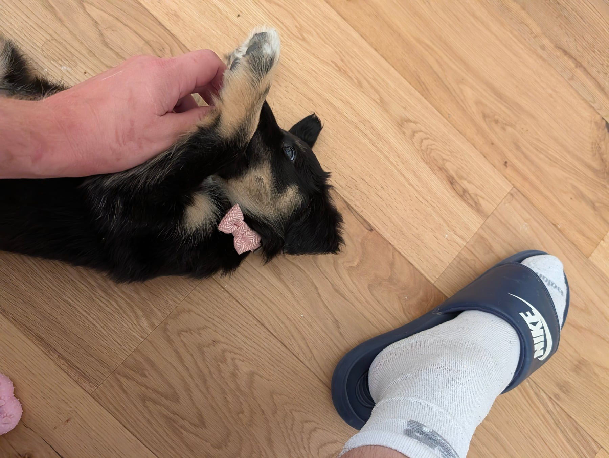
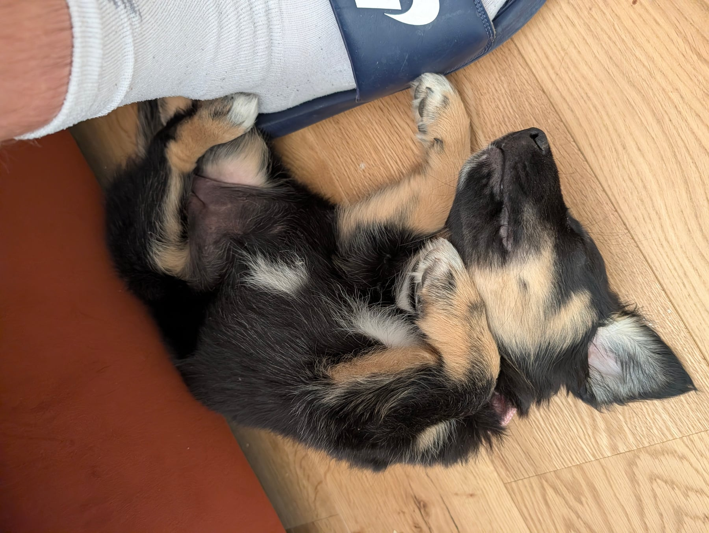
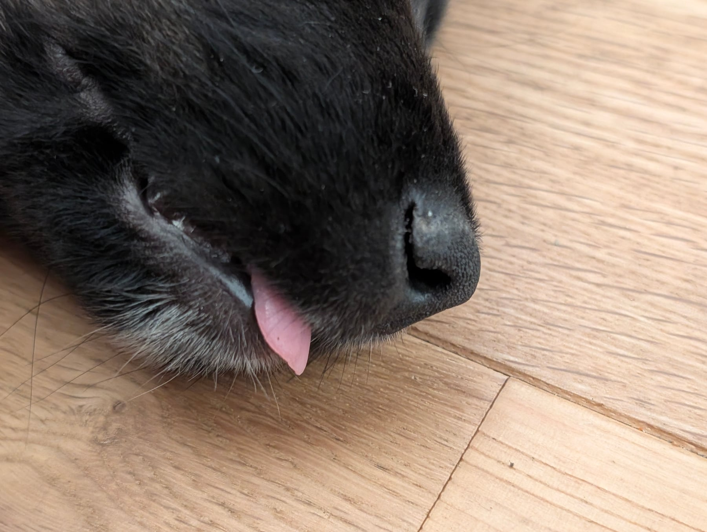

Busy day, and mostly a good one. Two toilet accidents, both really down to us not managing the environment well enough rather than her. She's actually doing very well there. Her name is starting to properly land, even with a bit of distraction around.

The big one: two trips near a busy road, and she stayed completely comfortable. Kept taking treats, said hello to neighbours, didn't bat an eyelid. That's the strongest sign yet that we're not pushing her past what she can handle. The lead went on for a few minutes, no expectations, just letting her move naturally.

The less glamorous bit: when she gets overtired, she turns into a little shark, nipping at us, at the sofa, unable to settle. We've started actively managing her wind-down time instead of just riding it out, which already feels like the right call.
