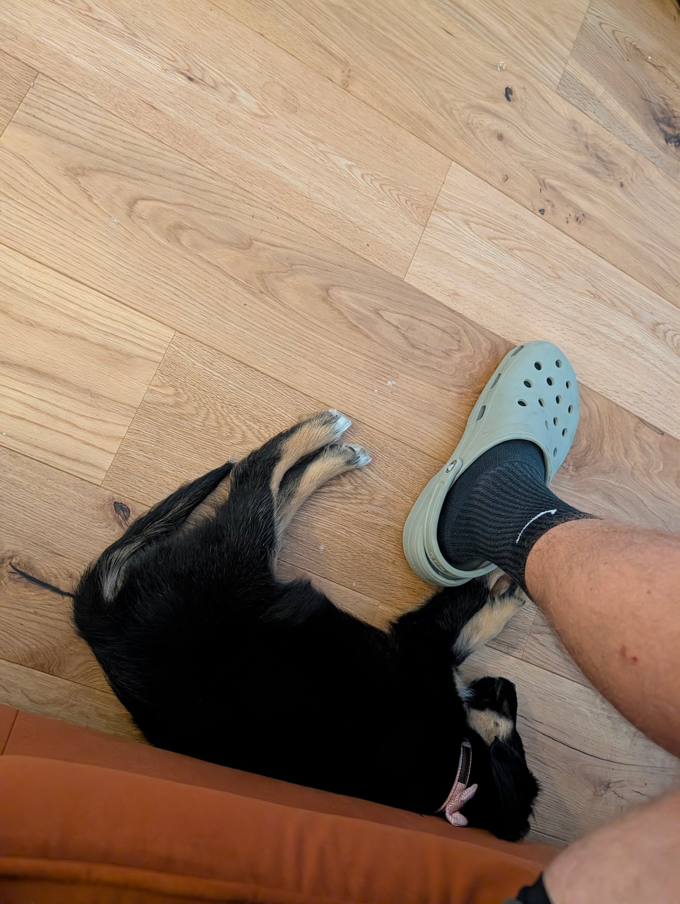
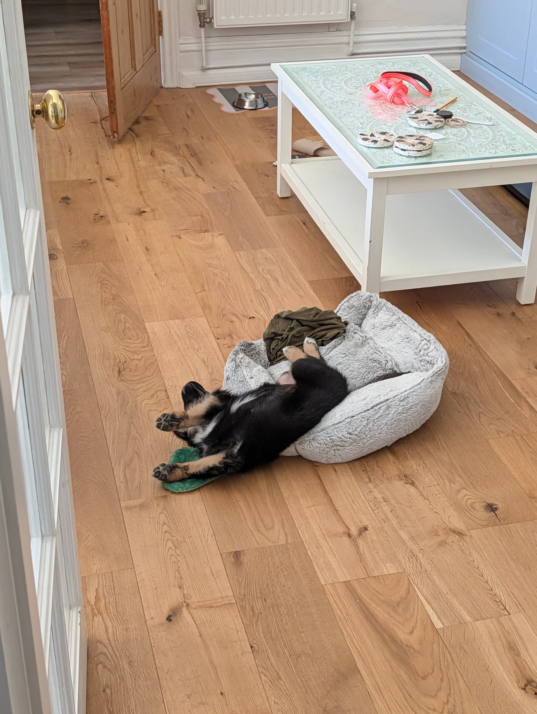

Bigger day today. We carried her out in the sling — her first real look at cars, vans, people, and a few children who stopped to say hello and give her a stroke. She had a couple of wobbly, uncertain moments, but bounced back every time and stayed playful, still happily taking treats through all of it.

At home, "Come" is really starting to make sense — several good reps through the day. She hit a whole 30 seconds of being left alone, completely unbothered, entertaining herself rather than needing us there. And in a nice surprise, she put herself to bed in the crate for a nap with the door wide open, entirely her own idea.

The pattern we're keeping an eye on: settle, get up, zoom around, start nipping at us or the sofa, repeat. Nothing alarming — just something to manage as she gets more confident and more overtired in the same afternoon.
