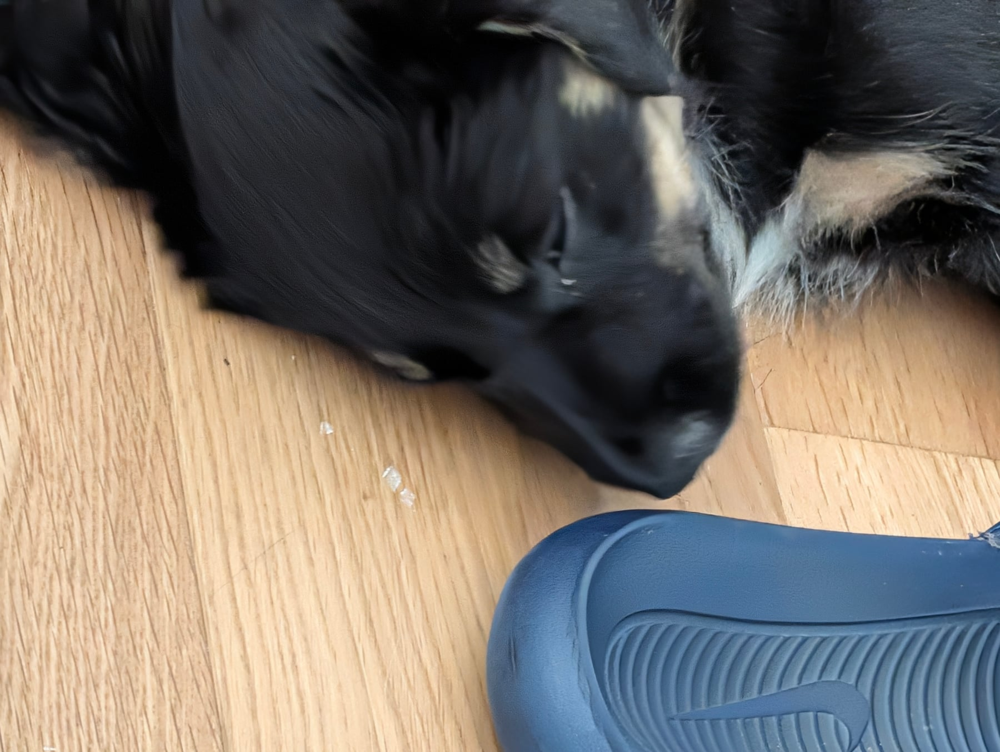

A deliberately quiet day at home, with the crate as the main event. Meals went in there with the door shut, kibble scattered inside to make it a good place to be, and she came and went freely all day. When we did close the door, we made a point of opening it again after a short, calm wait. The idea is that she learns the door reopening is the reliable part, not just that it closes.

We also rethought how we handle sofa-biting. Telling her off and physically moving her seemed to be teaching her the opposite of what we wanted. Sometimes it's genuine teething, but sometimes it's just a very effective way to get a reaction out of us. New approach: when she starts, Alisha and I both just stand up and turn away until she's calm again, no words, no fuss either way.

She also broke out of her makeshift cushion playpen at one point (a proper little ninja about it), so a real playpen has now been ordered, somewhere safe for her to be when she's overstimulated, alongside the crate.

New things today: rain, a hosepipe, more vacuum cleaner exposure, and the blender, all taken completely in her stride. The one exception: she's a bit unsure when the vacuum comes straight at her, though not distressed, just cautious.
