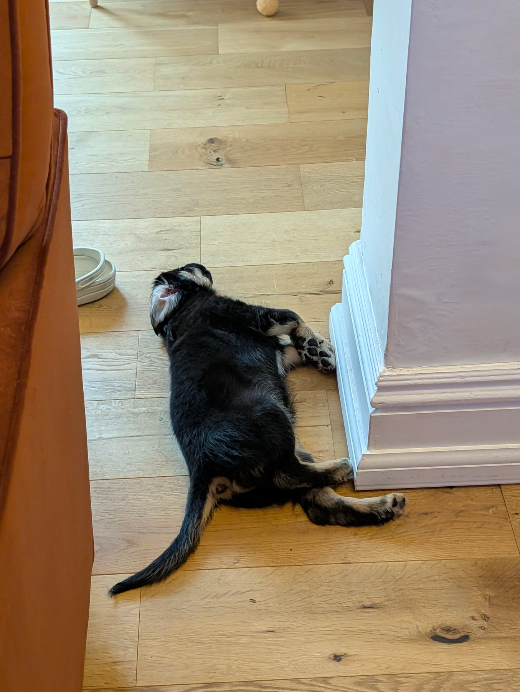
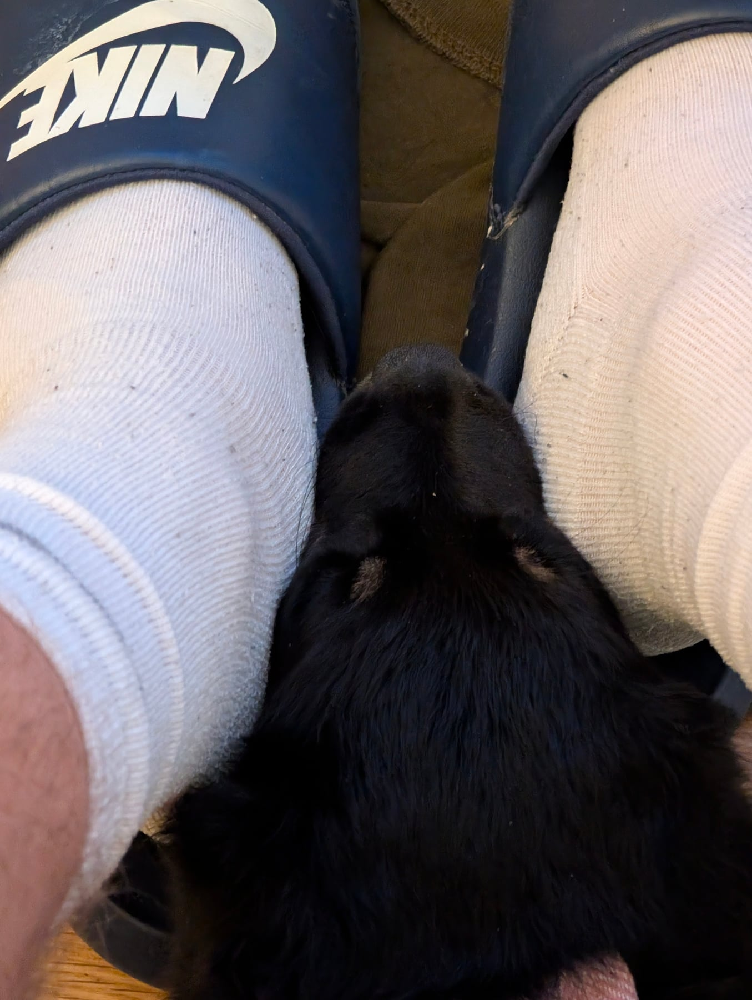

A proper step forward today. Leaving the room for two-plus minutes at a time — brushing teeth, going upstairs, generally moving around the house — barely registers with her anymore, door closed or not. We even went right out of the house, down the driveway and back, and she stayed relaxed the whole time.

Sat in the car with her during a proper downpour, rain hammering on the roof, and she was completely unbothered — fell asleep in the footwell afterwards. The new playpen went up properly today too, alongside the towel and the crate, as somewhere calm for her to be.

And a big one for her: first taste of peanut butter, off a lick mat. Went down extremely well. All in, a food-heavy, novelty-heavy day — probably a good one to follow with something quieter.
