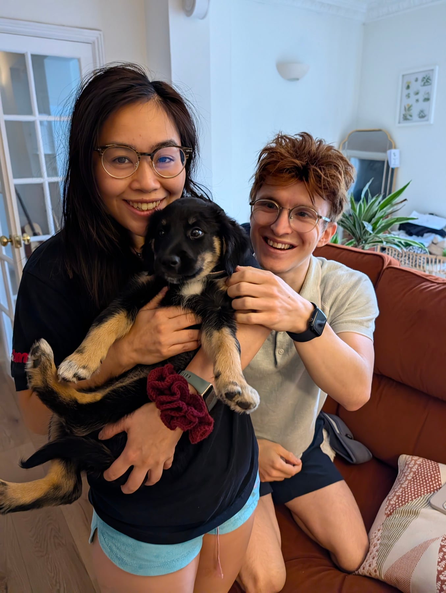
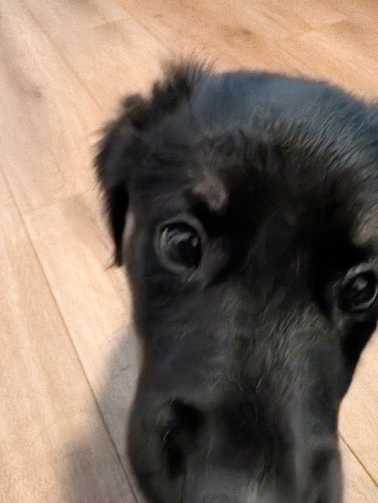

Another big one yesterday. She slept really well the night before and then woke up with the zoomies from the get-go, running rampant all morning. Digging, and finding new spots to dig in. Chewing. Everything a puppy testing the limits will do.

That ran into a couple of accidents in the house, including her first poo indoors, which is very unlike her. It goes to show how it keeps you on your toes. Things go well for a stretch and you get lulled into a false sense of security. The toilet training outside has actually been picking up nicely: generally she'll take herself out, do her business and come back in on her own. But she was so excited that I took my eyes off her for one second, and that was all it took. A few wees as well. It's raining more now that we're coming into autumn, so we've put mats down to stop muddy paws and dragged-in dirt going everywhere, and she decided the mats were the perfect spot to plop down and have a wee.

Lots of washing done, then. The more exciting bit: she was introduced to the Kong. We had friends round, food out on the coffee table, new people in the house, a lot going on. Perfect conditions for baby shark Annie to come out, with that much new stuff and that much temptation. The thing I keep coming back to with raising a puppy well is controlling the environment, and it's hard to control the environment when you're also looking after people and putting food out.

So she went in the playpen a few times with a Kong and some dog-safe peanut butter, which she absolutely loves and which keeps her busy for a good while. Then out of the playpen and, lo and behold, zoomies again. It was great for her to meet new people though, different sorts of people, all of it new information to her, and to get a proper fuss made of her. She was so loving with them, and I think Beth and Elliot enjoyed her company. She was just going to take every opportunity she could get.

It ended with an early night, taken upstairs into a safe space away from all the stimulation and the craziness, and then a big snooze right through.

This is the bit I think is easy to forget. You can control a lot of variables, but that kind of exposure isn't fully controllable, and at some point something has to give. Either you let the dog go crazy, which isn't fair on your guests, or you take the responsibility and take yourself out of the situation. Which meant I didn't get to socialise as much as I'd have liked. Such is life. That's one of the things you accept when you've got a pupper.

<blockquote class="instagram-media" data-instgrm-permalink="https://www.instagram.com/reel/DcqTl8VMmit/" data-instgrm-version="14"></blockquote>

