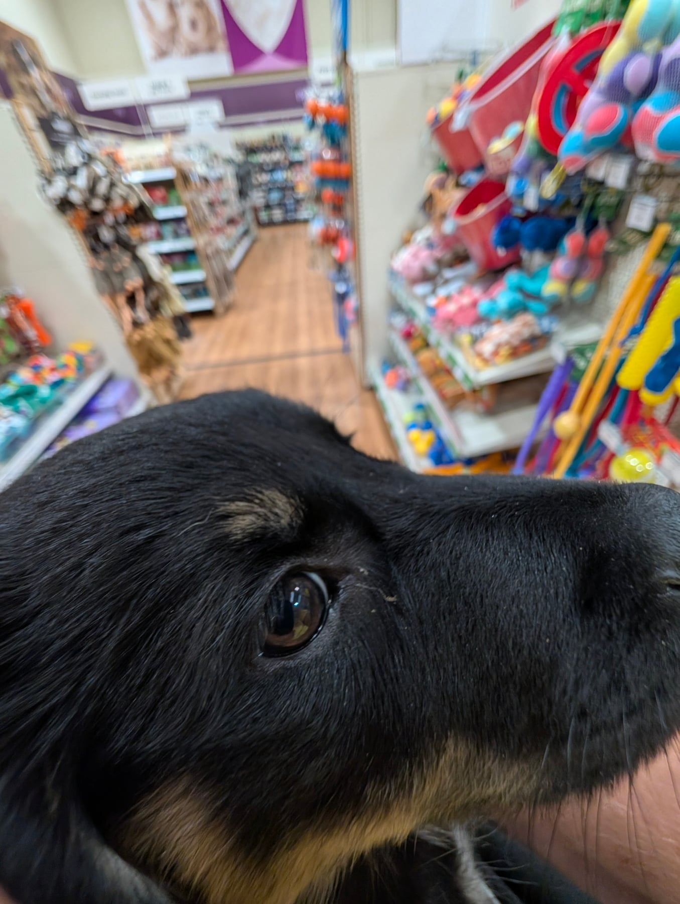
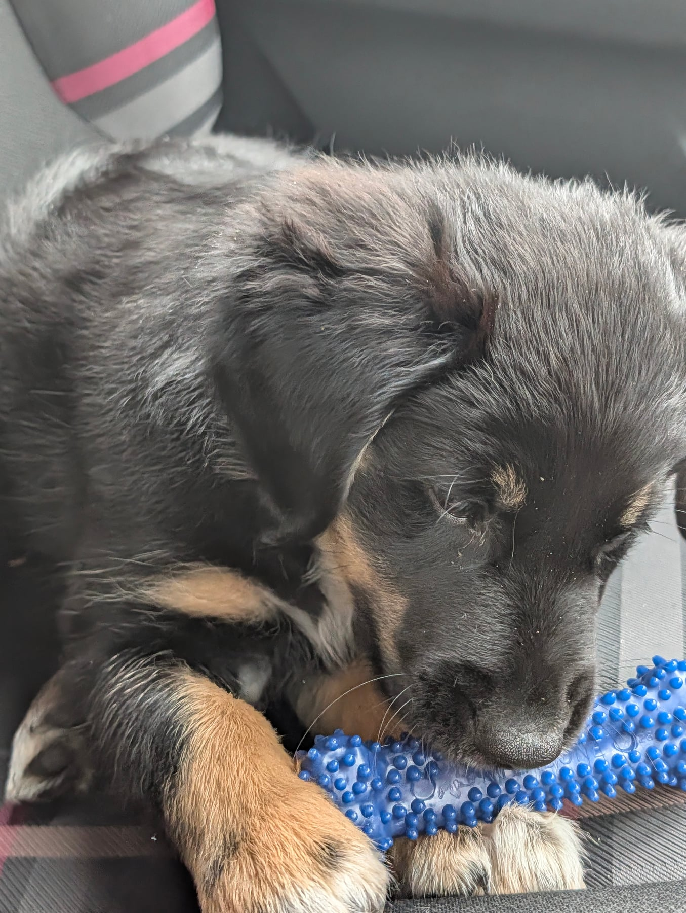
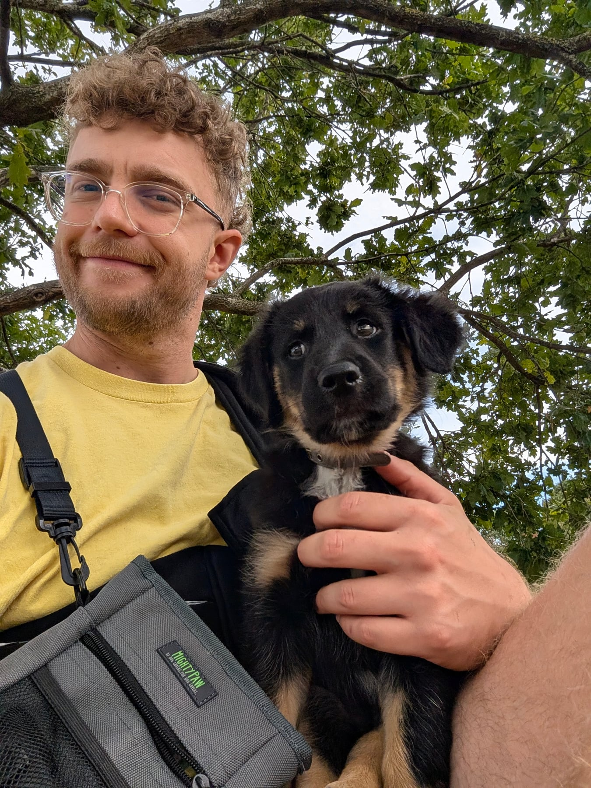
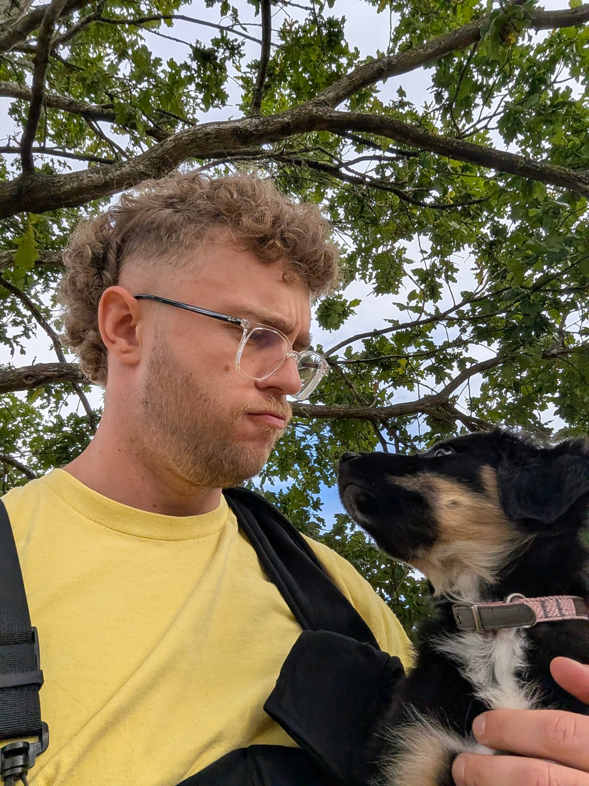

A more relaxed day yesterday, which she needed. We woke up and her friends were still here, so she got to say hello all over again, and got very excited about it all over again too.

Once they'd left we let her have the run of the place. After the last few days, all those new people and all that new information, I wanted to give her time to let her brain catch up. She took herself off for a big extra snooze, which felt like the right result.

Then more friends were coming through on a pub crawl to celebrate us moving into the new house, and ours was one of the stops on the way. Rather than have her in the middle of that, I took her out.

We went to Pets at Home, in her sling. This was her first trip to a pet shop. I'd been reading Easy Peasy Puppy Squeezy, the part about the biting stage and how normal it is, what's actually going on for her while it's happening, and it made me want to go and find her some better options.

We walked round the whole shop. Other dogs, other people, and a few people who stopped to say hello and were kind and gentle with her.

We came away with Nylabone chews, some 100% venison freeze-dried treats that cost more than I'm going to admit to, a chew toy you freeze with a rag wrapped round it, a puppy wishbone and some dental sticks. About £40 all in. The whole idea is to give her something she actually wants to bite, so that it isn't the coffee table. For the record, the Crocs are still her favourite thing in the entire world and nothing I bought has come close.

She slept most of the way.

We stopped at a local park and sat on a bench for a while, just watching the world go by and letting her take it in. I showed her where she'll be running about off the lead one day, owning the place.

A couple more accidents indoors. I think she's starting to work out what she can get away with. I'm trying hard not to tell her off, just to redirect her. Twice now I've caught her deciding she doesn't fancy the rain, finding a nice corner instead, and I've steered her outside and made a fuss of her when she got it right.

The crate is still the work in progress. I want it to feel like her place, somewhere safe and good to be, and that's easier said than done when she'd rather be next to you every second. She'll sit in the playpen and just watch me.

The good news is that upstairs is turning into her chill-out zone. She's got her crate up there and an area marked off, and she settles much faster in it, I think because it takes her out of whatever's going on downstairs. Her new chews are up there too, minus the Crocs. That matters more than it sounds, because if she doesn't get her 18 to 20 hours, baby shark turns up.
