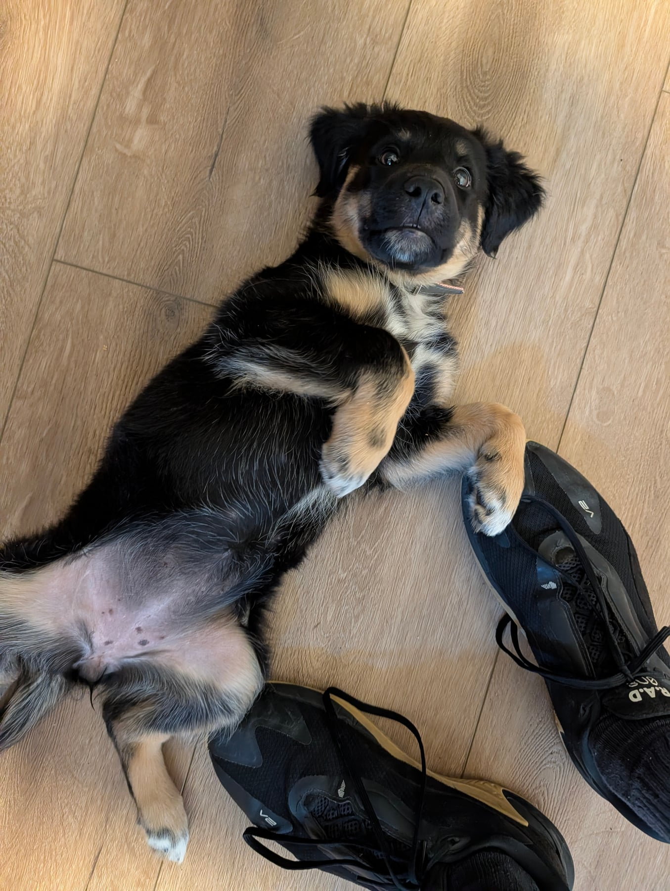

She's found it a lot easier to settle in the crate upstairs, where she's got her own cordoned-off bit of the room. The pen downstairs is a different story at the moment, and she's struggling to settle in it at all.

I think it's the stimulation. There's so much going on in that part of the house, so many things to keep half an eye on, that she can't switch off and just relax. The pen sits right in the middle of it.

So we're working on making it her safe place. Lots of treats, lots of rewards, and we've started feeding her in there. Nothing clever, just stacking up the idea that good things happen in the pen.

Still figuring that one out. It's all part of the process, and there's nothing actually wrong here.

<blockquote class="instagram-media" data-instgrm-permalink="https://www.instagram.com/reel/DctiKRKsIFM/" data-instgrm-version="14"></blockquote>

