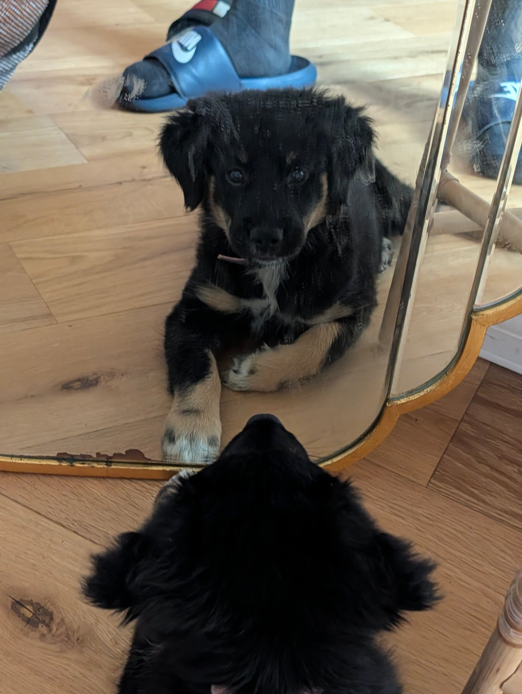
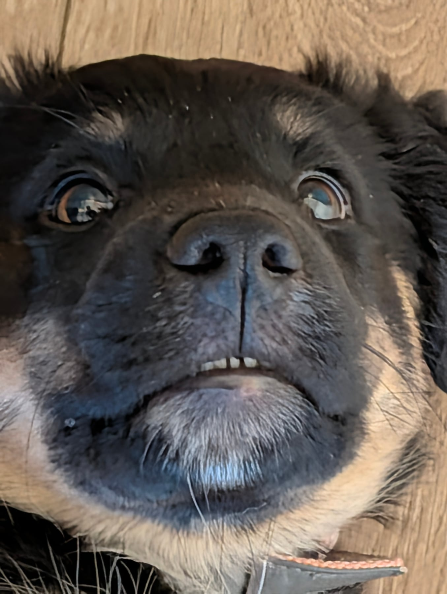

We found a rhythm again yesterday, which we'd rather lost over the weekend. She slept right through the night, woke up ready to go, and spent a good chunk of the morning working her way round all of her toys.

The bit that's working is letting her switch off properly when she needs to, and the place that happens is upstairs by her crate. That's excellent now. Downstairs in the playpen is still the puzzle, same as I wrote yesterday, and I haven't cracked it yet.

Lots of play, and plenty of exercise with the new toys. We've added another one to the pile, a Kong on a rope, which is apparently the most exciting object ever made. The idea came out of one of the books: give her different textures to chew, because if she's going at the sofa she probably wants something ropey, and if she's going at a chair leg she probably wants the nylon bone. So I'm trying to cover all the bases. Given a free vote she would still pick the slippers, the sliders and the Crocs.

Speaking of books, Total Recall was delivered and I've made a start on it. Not the Arnold Schwarzenegger one. (Is that a film? An autobiography? I genuinely don't know.) It's about recall, obviously, but it goes further into the psychology of it: why she makes the choice she makes, what she actually needs, how to reinforce something so that it sticks. I'm really enjoying it and it's been quite enlightening.

It's also got me thinking about whether we should get some professional help, rather than me and Alisha working it all out between us. Not because anything is going wrong. I'm just curious about doing it properly and giving her the best life I can.

I keep coming back to the CrossFit comparison. I pay for coaching there. I want to get better, so I follow a programme, and the structure and the accountability are the entire point. I could muddle through on my own. It would just be slower, and worse. So why would I not do the same for a dog who's going to be with us for, all being well, a very long time?

She's been learning down, and we've started properly enforcing a couple of rules: no jumping up on the sofa, and no going at the coffee table. It's less telling her off and more steering her away from the thing she wants and into something calmer, then paying her well for being there. Better for her, and a lot better for the rest of the house.

She went up the stairs, with a bit of goading with treats and a couple of pushes on the bum, and she's starting to get the hang of it. Brilliant to watch. A while to go before she's doing it on her own, which is probably for the best.

She had her first bath. We used a lick mat and a very soft shower head, took it slowly, and paused wherever she seemed happy. She kept taking food the whole way through, which was the thing I was watching for. Light touch, and we stopped well before she'd had enough of it. The result is a somewhat cleaner dog.

What I'm after is a dog who doesn't mind a bath, rather than one who spends the rest of her life trying to climb out of one. Long way to go, but that's the direction.
