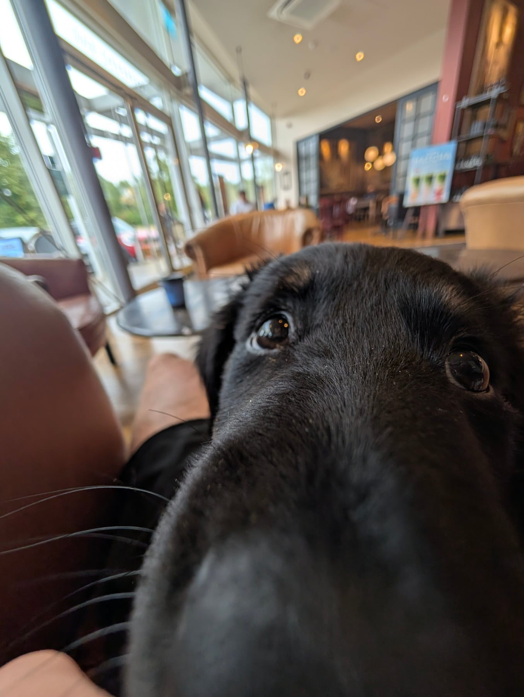

Things are going well. She's full of energy and growing at a rate, and she's hit that gangly stage where her legs look slightly too long for the rest of her. She's also worked out that she can jump, and she's making full use of it. Lots of ball fetch at the moment, which is a good way of pointing all that energy at something.

The big one for me was taking her to a coffee shop in her sling. That is one of my selfish little visions for having a dog: go out for a walk, drop into a coffee shop, and have a cute dog sitting next to me. Got to do it, and it was every bit as good as I wanted it to be.

She also went up the stairs on her own for the first time. No goading with treats, no hand on her bum, just up she went. And she has basically got "down" now with no hand cue at all, just the word.

Progressing nicely, all told.
