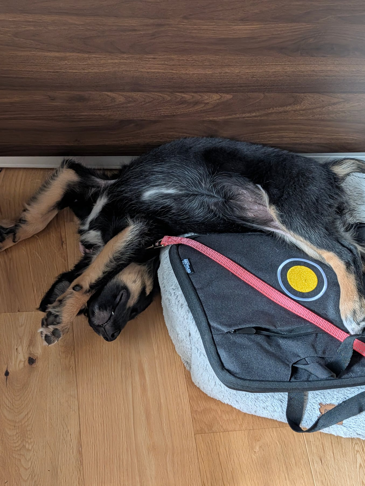

I was away over the weekend, so Annie stopped with Alisha. A girls' weekend, let's say. There's no record of it here because I wasn't there to write one, and I came back on the Tuesday.

While I was gone she'd had her vaccination, which starts the clock on getting her out on proper walks. In the meantime we've been doing lots of lead awareness, just getting her used to wearing one and having it on her.

The other change is that I've started a new job, and she's had to learn to be tethered to her lead during the day. When I'm working she has her own area, a half-circle radius around where I sit, so she's close by. She's got a couple of bed options in it and plenty of toys. Surprisingly, it has helped her learn to calm down a bit quicker.

I think there's something in that. I'd been rushing her exposure to freedom in the house, and it turns out a bit of constraint actually lets her settle more. She isn't ready for big, wide open spaces at her current level of maturity. Good to know.
