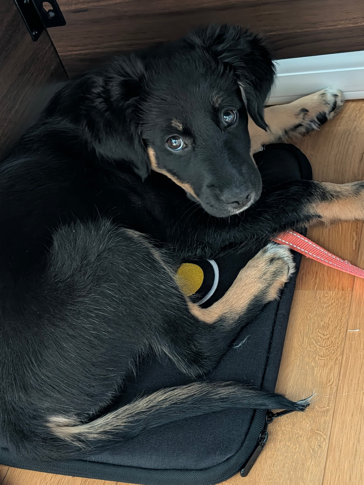

She's been learning "place". The idea is that she can go to an area and, in the long run, look to settle there, because at the moment she doesn't calm down very well, and that gets trickier the more tired she is. So we're controlling the environment and also giving her a word that means settle. She's picked up the first half of it: she knows where to go, and that good things happen when she goes there.

The bit we're working on now is "stay", which is what's left. Eventually, if someone's at the door or there's a visitor round, or we just need her out of the way for her own safety or to stop her being a little nuisance, she can go there and be safe and sound.

Toilet breaks outside have been good. It's easy to stop reinforcing the behaviour once it's mostly working, which is something I've been picking back up on: just rewarding her for doing the right thing out there. She still gets a bit confused by carpet, I think because of the texture, and could use it as a place to go. But those are few and far between, so it's not too bad. It's just redirecting her straight away.

She's become comfortable going up the stairs. You can call her and she'll come running up, which is good. She's also done all but one of them on her own, with a little bit of coaxing and encouragement, but she did do it.

One thing we've really been focusing on is trying to stop her jumping up. A trainer whose content I really like is Will Atherton. I watched a lot of him years ago with a different dog, and because he's British and straight talking, even if he plays it up a bit for YouTube, he's a genuinely useful resource. His explanation of operant conditioning and of being a safe leader for your dog has been really helpful, and we've been using some of his methods on the jumping. Right now she doesn't really understand the word "no", and there's no negative association to it. So it's about being disciplined, being a good leader, and setting her up to succeed.
