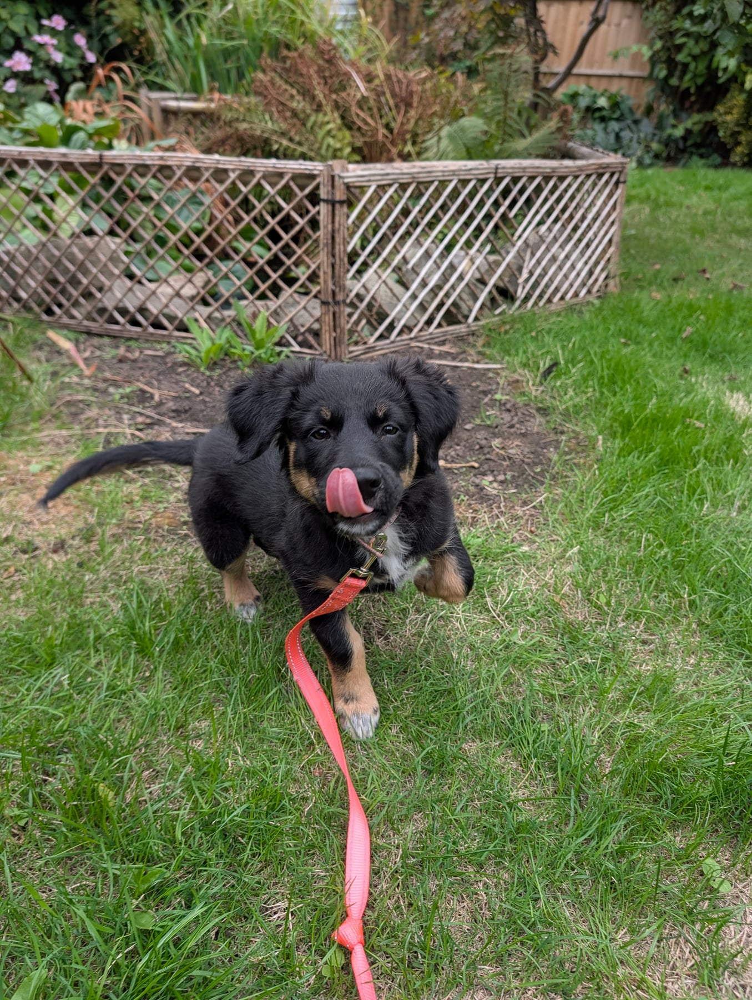
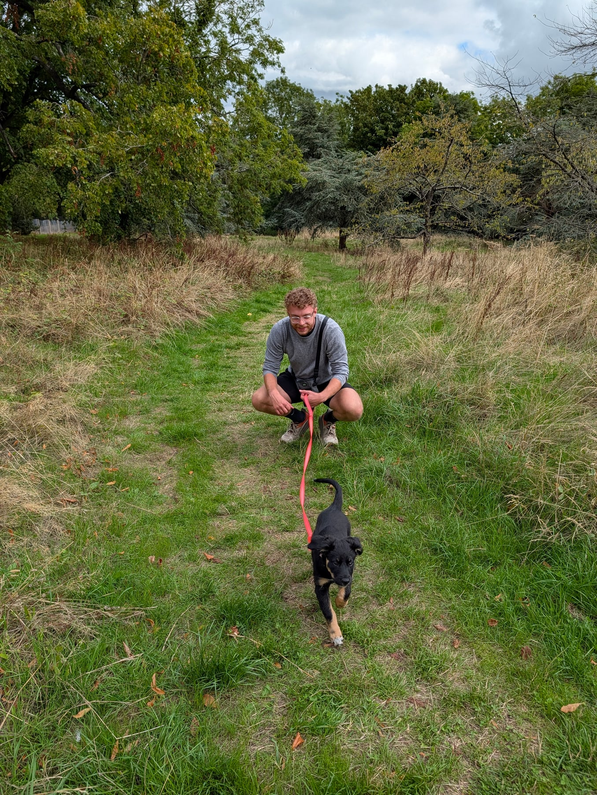
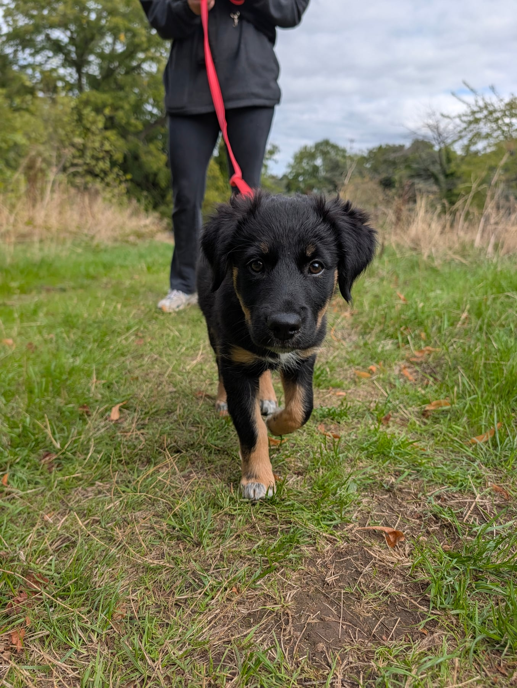
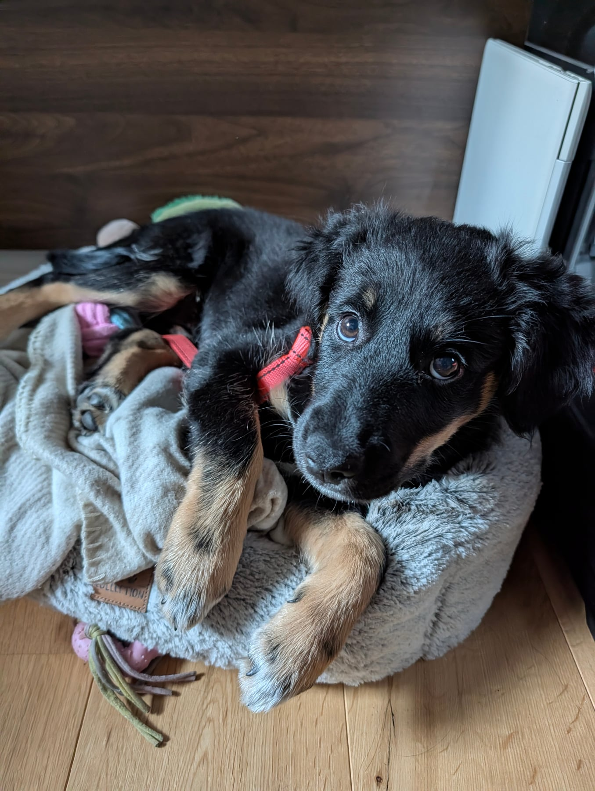

On Thursday night we let her roam around the garden with a lead on, which she was absolutely baffled by. Very excitable, but lots of sniffs and lots of exposure to grass, twigs and everything else you'd find out there. She had a great time. We kept it short and sweet, ten minutes for her little brain to take it all in, and as soon as she came back in she was straight asleep. Definitely worthwhile.

On Friday she got the all clear from the vaccinations.

So we took her on her first proper walk. We went to the park, and she got to see a big open space, a big field, all that grass, and all the new smells and sounds that come with it. Which meant she was very tired.

One thing I'm really keen on throughout this is to set her up for success and teach her good manners on the lead while she's a puppy, so the good habits are there early. I don't want to teach her to pull, or to try and lead the walk, because that's dangerous for her and not a pleasant experience for anyone.

Lots to do in there, but she got lots of cute pictures.

