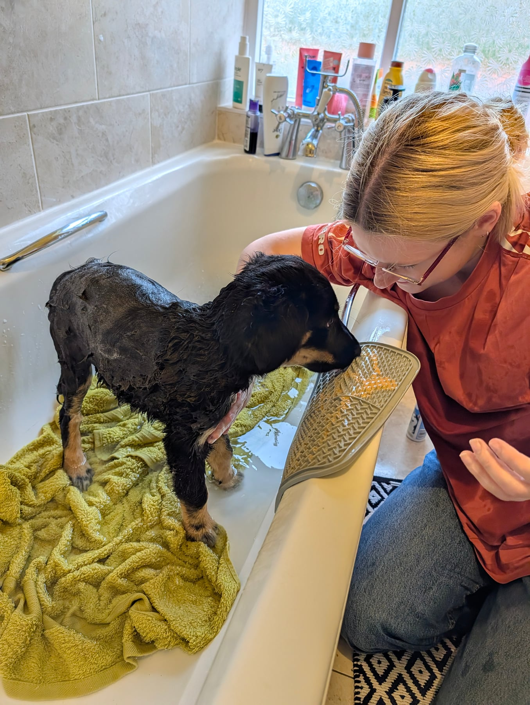
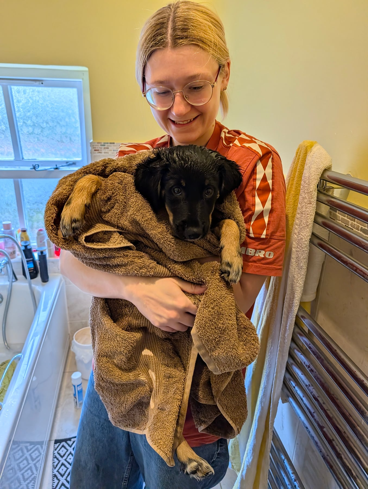

A busy day. She got some extra toys, because Aldi's middle aisle was doing its pet thing: a pig, a new feeder toy, which she loves, and a new dog bed. She's been thoroughly spoiled, with lots and lots of treats, and we've been working through all the different activities for her. Keeping her skills topped up and trying to get the fundamentals done properly, so that she stays safe.

The massive win, though. She went onto the high street early in the morning and had a walk around. Lots of new smells again, all new information. And then we went to a coffee shop. Alisha and I had a coffee, and she got to see other dogs, all the coffee shop sounds, other people, and children. She was absolutely fine.

We kept her at a distance as best we could, let her take it all in, steered her away from anything that looked overwhelming, and kept an eye on her. The big plan to have a dog who enjoys the coffee shop is underway, and it was a very successful day.

She also had her second bath, and she has really been a good girl about it. Lots of peanut butter on a lick mat, and it was a two-person job, but we got there in the end. She is now soft and fluffy and ready to roll in some more dirt.

